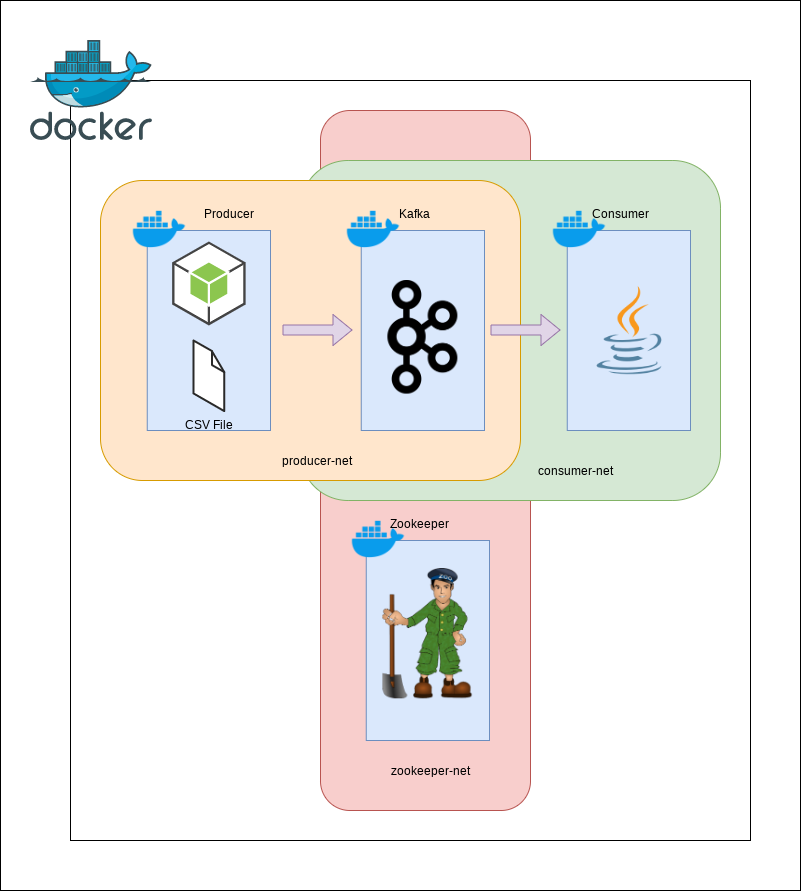

# Configurações do swarm para cluster

## Inicializar Stack

Executar os comandos:

```sh
docker swarm init
docker network create -d overlay zookeeper-net
docker network create -d overlay producer-net
docker network create -d overlay consumer-net
docker stack deploy -c docker-compose.yml stack_fiap
```

Ou executar o arquivo `init.sh`

## Arquitetura

